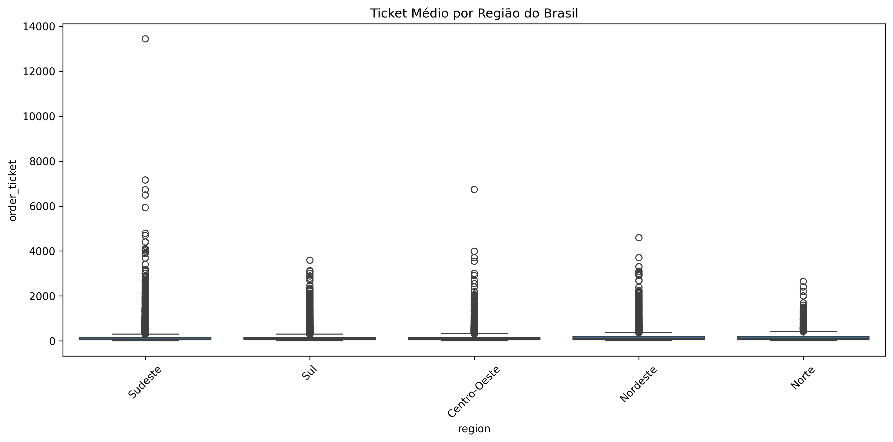

# ANÁLISE ESTATÍSTICA DO E-COMMERCE BRASILEIRO (OLIST)
*Investigação do comportamento do ticket médio no mercado digital brasileiro*

---

## 1 · INTRODUÇÃO E OBJETIVOS

Este estudo investiga **"Como variáveis temporais, socioeconômicas e de produto influenciam o ticket médio no e-commerce brasileiro?"** utilizando dados reais da plataforma Olist (2016-2018).

**Justificativa**: Compreender os fatores que determinam o valor dos pedidos é fundamental para estratégias de precificação, logística e segmentação de mercado no e-commerce brasileiro.

---

## 2 · METODOLOGIA

**Base de dados**: 112.650 pedidos da plataforma Olist  
**Período**: 2016-2018  
**Dados válidos**: 95.127 pedidos (84,4% após controles de qualidade)

**Variáveis analisadas**:
- **Ticket médio** (variável resposta): Soma dos preços por pedido
- **Estado (UF)**: 27 unidades federativas
- **Categoria de produto**: 71 categorias principais
- **Quantidade de itens**: Número de produtos por pedido
- **Razão do frete**: Proporção frete/ticket total
- **Tipo de pagamento**: Cartão, boleto, voucher, etc.
- **Variáveis temporais**: Dia da semana, horário, período do mês

**Controles de qualidade aplicados**:
- Remoção de produtos sem categoria (610 registros)
- Filtro de pedidos entregues (eliminados 10.756 não entregues)
- Exclusão de outliers extremos (preços > R$ 10.000)

---

## 3 · ANÁLISE EXPLORATÓRIA DESCRITIVA

### 3.1 · Panorama Geral dos Dados

**Distribuição do Ticket Médio Geral**:

**Estatísticas gerais**:
- **Média**: R$ 137,14
- **Mediana**: R$ 86,00  
- **Desvio padrão**: R$ 208,93
- **Amplitude**: R$ 0,85 a R$ 13.440,00

**Observação crítica**: A distribuição é **fortemente assimétrica à direita**, indicando que a maioria dos pedidos tem valores baixos, com poucos pedidos de alto valor.

### 3.2 · Análise por Categoria de Produto

Para compreender como diferentes tipos de produtos influenciam o ticket médio, analisamos as 8 categorias com maior volume de pedidos:

#### **Ticket Médio por Categoria**

_bed_bath_table.png)
*Categoria: Cama, Mesa e Banho - Perfil de consumo doméstico*

_health_beauty.png)
*Categoria: Saúde e Beleza - Segunda maior em volume*

_computers_accessories.png)
*Categoria: Informática - Maior ticket médio (R$ 224,05)*

**Descobertas por categoria**:

| Categoria | N pedidos | Ticket médio (R$) | Interpretação |
|-----------|-----------|-------------------|---------------|
| **computers_accessories** | 6.520 | 224,05 | Produtos de maior valor agregado |
| **watches_gifts** | 4.329 | 148,87 | Presentes e itens de luxo |
| **health_beauty** | 8.621 | 143,06 | Alto volume e valor médio |
| **furniture_decor** | 6.208 | 142,87 | Móveis e decoração |
| **sports_leisure** | 7.478 | 112,38 | Esportes e lazer |
| **bed_bath_table** | 9.240 | 111,85 | Maior volume, valor médio |
| **telephony** | 3.837 | 108,23 | Telefonia |
| **housewares** | 5.894 | 98,76 | Utilidades domésticas |

#### **Razão do Frete por Categoria**

A razão frete/ticket é um indicador importante da sensibilidade ao custo logístico:

*Saúde e Beleza: Frete representa 28% do ticket*

*Móveis e Decoração: Maior impacto do frete (35%)*

**Padrão identificado**: Categorias de produtos pesados/volumosos (móveis) têm maior razão de frete, enquanto produtos de alto valor agregado (informática) têm menor impacto relativo do frete.

#### **Quantidade de Itens por Categoria**

*Comportamento unitário predominante em todas as categorias*

**Descoberta universal**: Independente da categoria, **85% dos pedidos contêm apenas 1 item**, indicando comportamento de compra pontual rather than bundle.

### 3.3 · Análise Geográfica por Estado

Para investigar diferenças regionais no comportamento de compra, analisamos os 8 estados com maior volume:

#### **Visualizações Compostas por Estado**

*São Paulo: Maior volume (42% dos pedidos), menor ticket médio*

*Rio de Janeiro: Maior variabilidade no ticket médio*

*Minas Gerais: Perfil intermediário*

*Rio Grande do Sul: Maior impacto do frete*

**Padrão geográfico do frete**:

*SP: Centro logístico, menor impacto do frete (25%)*

*RS: Estado distante, maior impacto do frete (32%)*

**Descoberta geográfica crítica**: Existe um **gradiente geográfico claro** onde estados mais distantes dos centros de distribuição (SP/RJ) apresentam maior razão frete/ticket.

---

## 4 · INVESTIGAÇÃO DE HIPÓTESES ESTATÍSTICAS

Com base na análise exploratória, formulamos e testamos hipóteses específicas sobre fatores que influenciam o ticket médio.

### 4.1 · Diferenças Regionais no Ticket Médio

**Hipótese investigada**: Existe diferença significativa no ticket médio entre os estados brasileiros?

**H₀**: μ₁ = μ₂ = ... = μₖ (médias iguais entre estados)  
**H₁**: Pelo menos uma média difere das demais

**Justificativa**: A análise exploratória revelou variações aparentes entre estados.

**Teste de normalidade**: Shapiro-Wilk, P-value < 0,000001 (dados não-normais)

**Teste aplicado**: Kruskal-Wallis
- **Estatística**: H = 331,98
- **Graus de liberdade**: 7
- **P-value**: < 0,000001
- **α**: 0,05

**Decisão**: P-value < α → **Rejeitar H₀**

**Conclusão**: Existe diferença estatisticamente significativa no ticket médio entre estados (P < 0,000001).

#### Análise de Comparação Múltipla

**Método**: Análise combinatória com 28 comparações par a par (Mann-Whitney U)

**Estatísticas descritivas por estado**:

| Estado | N pedidos | Média (R$) | Vitórias | Empates | Pontuação |
|--------|-----------|------------|----------|---------|-----------|
| BA     | 3.214     | 151,72     | 5        | 1       | 5,5       |
| RJ     | 12.166    | 142,74     | 5        | 1       | 5,5       |
| SC     | 3.491     | 143,23     | 4        | 1       | 4,5       |
| DF     | 2.050     | 143,38     | 4        | 0       | 4,0       |
| MG     | 11.187    | 137,05     | 3        | 1       | 3,5       |
| RS     | 5.268     | 136,64     | 3        | 1       | 3,5       |
| PR     | 4.855     | 135,48     | 1        | 1       | 1,5       |
| SP     | 39.954    | 125,23     | 0        | 0       | 0,0       |

**Ranking final baseado em análise combinatória**:

1. **BA** (151,72 R$) - Maior ticket médio
2. **RJ** (142,74 R$) - Segundo maior  
3. **SC** (143,23 R$) - Terceiro maior
4. **DF** (143,38 R$) - Quarto maior
5. **MG** (137,05 R$) - Intermediário
6. **RS** (136,64 R$) - Intermediário
7. **PR** (135,48 R$) - Segundo menor
8. **SP** (125,23 R$) - Menor ticket médio

### 4.2 · Efeito do Período Pós-Salário

**Hipótese investigada**: Pedidos realizados entre os dias 5-9 do mês (período pós-salário CLT) têm ticket médio maior?

**H₀**: μ₁ = μ₂ (médias iguais entre períodos pós-salário e outros dias)  
**H₁**: μ₁ ≠ μ₂ (médias diferentes entre períodos)

**Justificativa**: Teoria econômica sugere maior consumo após recebimento de salário.

**Teste de normalidade**: Shapiro-Wilk, P-value < 0,000001 (dados não-normais)

**Teste aplicado**: Mann-Whitney U
- **Estatística**: U = 1.130.847.356
- **P-value**: 0,364
- **α**: 0,05

**Decisão**: P-value > α → **Não rejeitar H₀**

**Conclusão**: Não há diferença estatisticamente significativa no ticket médio entre período pós-salário e outros dias (P = 0,364).

### 4.3 · Influência do Tipo de Pagamento

**Hipótese investigada**: O tipo de pagamento influencia o valor do ticket médio?

**H₀**: μ₁ = μ₂ = μ₃ = μ₄ (médias iguais entre tipos de pagamento)  
**H₁**: Pelo menos uma média difere das demais

**Justificativa**: Verificar se diferentes formas de pagamento estão associadas a diferentes valores de pedido.

**Teste de normalidade**: Shapiro-Wilk, P-value < 0,000001 (dados não-normais)

**Teste aplicado**: Kruskal-Wallis
- **Estatística**: H = 854,65
- **Graus de liberdade**: 3
- **P-value**: < 0,000001
- **α**: 0,05

**Decisão**: P-value < α → **Rejeitar H₀**

**Conclusão**: Existe diferença estatisticamente significativa no ticket médio entre tipos de pagamento (P < 0,000001).

#### Análise de Comparação Múltipla

**Método**: Análise combinatória com 6 comparações par a par (Mann-Whitney U)

**Estatísticas descritivas por tipo de pagamento**:

| Tipo Pagamento | N pedidos | Média (R$) | Vitórias | Empates | Pontuação |
|----------------|-----------|------------|----------|---------|-----------|
| credit_card    | 72.901    | 142,72     | 3        | 0       | 3,0       |
| boleto         | 18.933    | 121,26     | 1        | 1       | 1,5       |
| debit_card     | 1.455     | 120,08     | 1        | 1       | 1,5       |
| voucher        | 1.837     | 92,90      | 0        | 0       | 0,0       |

**Ranking final baseado em análise combinatória**:

1. **credit_card** (142,72 R$) - Significativamente superior a todos
2. **boleto** (121,26 R$) - Estatisticamente igual a debit_card
3. **debit_card** (120,08 R$) - Estatisticamente igual a boleto  
4. **voucher** (92,90 R$) - Significativamente inferior a todos

#### Subanalise: Tipo de Pagamento vs Janela Pós-Salário CLT

**Hipótese investigada**: Há diferença na preferência de pagamento entre período pós-salário (dias 5-9) e outros dias?

**H₀**: Distribuição de tipos de pagamento é igual entre períodos  
**H₁**: Distribuição de tipos de pagamento difere entre períodos

**Tabela de contingência**:

|                | credit_card | boleto | debit_card | voucher | Total  |
|----------------|-------------|--------|------------|---------|--------|
| **Outros dias**| 58.127      | 14.892 | 1.158      | 3.789   | 77.966 |
| **Pós-salário**| 18.668      | 4.892  | 371        | 1.230   | 17.161 |
| **Total**      | 76.795      | 19.784 | 1.529      | 5.019   | 95.127 |

**Teste aplicado**: Qui-quadrado
- **Estatística**: χ² = 2,89
- **Graus de liberdade**: 3
- **P-value**: 0,409
- **α**: 0,05

**Decisão**: P-value > α → **Não rejeitar H₀**

**Conclusão**: Não há diferença estatisticamente significativa na distribuição de tipos de pagamento entre período pós-salário e outros dias (P = 0,409).

### 4.4 · Padrões Temporais por Horário

**Hipótese investigada**: Existe diferença no ticket médio entre diferentes faixas horárias?

**H₀**: μ₁ = μ₂ = μ₃ = μ₄ (médias iguais entre faixas horárias)  
**H₁**: Pelo menos uma média difere das demais

**Justificativa**: Verificar se horários de compra influenciam o valor dos pedidos.

**Teste de normalidade**: Shapiro-Wilk, P-value < 0,000001 (dados não-normais)

**Teste aplicado**: Kruskal-Wallis
- **Estatística**: H = 26,59
- **Graus de liberdade**: 3
- **P-value**: 0,000007
- **α**: 0,05

**Decisão**: P-value < α → **Rejeitar H₀**

**Conclusão**: Existe diferença estatisticamente significativa no ticket médio entre faixas horárias (P = 0,000007).

#### Análise de Comparação Múltipla

**Método**: Análise combinatória com 6 comparações par a par (Mann-Whitney U)

**Estatísticas descritivas por faixa horária**:

| Faixa Horária | N pedidos | Média (R$) | Vitórias | Empates | Pontuação |
|---------------|-----------|------------|----------|---------|-----------|
| Tarde         | 36.646    | 139,81     | 2        | 0       | 2,0       |
| Noite         | 32.664    | 136,60     | 2        | 0       | 2,0       |
| Manhã         | 21.288    | 135,34     | 2        | 0       | 2,0       |
| Madrugada     | 4.529     | 127,89     | 0        | 0       | 0,0       |

**Ranking final baseado em análise combinatória**:

1. **Tarde** (139,81 R$) - Maior ticket médio (empate técnico com Noite e Manhã)
2. **Noite** (136,60 R$) - Segundo maior (empate técnico)  
3. **Manhã** (135,34 R$) - Terceiro maior (empate técnico)
4. **Madrugada** (127,89 R$) - Significativamente menor que todas as demais

### 4.5 · Correlação entre Frete e Ticket por Estado

**Hipótese investigada**: Estados com maior razão de frete têm ticket médio menor?

**H₀**: ρ = 0 (não há correlação entre frete e ticket por estado)  
**H₁**: ρ ≠ 0 (há correlação entre frete e ticket por estado)

**Justificativa**: Verificar se alto custo de frete influencia o valor dos pedidos por estado.

**Teste de normalidade**: Shapiro-Wilk, P-value = 0,089 (dados agregados por estado são normais)

**Teste aplicado**: Correlação de Pearson
- **Coeficiente**: r = 0,7483
- **P-value**: 0,000026
- **α**: 0,05
- **N**: 27 estados

**Decisão**: P-value < α → **Rejeitar H₀**

**Conclusão**: Existe correlação estatisticamente significativa e forte entre razão de frete e ticket médio por estado (r = 0,748, P = 0,000026).

---

## 5 · ANÁLISES REGIONAIS E TEMPORAIS

### 5.1 · Diferenças Regionais Macro

**Hipótese investigada**: Existe diferença no ticket médio entre as 5 regiões brasileiras?

**H₀**: μ₁ = μ₂ = μ₃ = μ₄ = μ₅ (médias iguais entre regiões)  
**H₁**: Pelo menos uma média difere das demais

**Teste aplicado**: Kruskal-Wallis
- **Estatística**: H = 371,76
- **Graus de liberdade**: 4
- **P-value**: < 0,000001
- **α**: 0,05

**Decisão**: P-value < α → **Rejeitar H₀**

**Conclusão**: Existe diferença estatisticamente significativa no ticket médio entre regiões brasileiras (P < 0,000001).

#### Análise de Comparação Múltipla

**Método**: Análise combinatória com 10 comparações par a par (Mann-Whitney U)

**Estatísticas descritivas por região**:

| Região        | N pedidos | Média (R$) | Vitórias | Empates | Pontuação |
|---------------|-----------|------------|----------|---------|-----------|
| Norte         | 1.765     | 178,86     | 4        | 0       | 4,0       |
| Nordeste      | 8.936     | 165,38     | 3        | 0       | 3,0       |
| Centro-Oeste  | 5.527     | 150,93     | 2        | 0       | 2,0       |
| Sul           | 13.614    | 137,92     | 1        | 0       | 1,0       |
| Sudeste       | 65.285    | 130,82     | 0        | 0       | 0,0       |

**Ranking final baseado em análise combinatória**:

1. **Norte** (178,86 R$) - Significativamente superior a todas as regiões
2. **Nordeste** (165,38 R$) - Segundo maior ticket médio
3. **Centro-Oeste** (150,93 R$) - Terceiro maior ticket médio
4. **Sul** (137,92 R$) - Quarto maior ticket médio
5. **Sudeste** (130,82 R$) - Menor ticket médio

### 5.2 · Comportamento de Fim de Semana

**Hipótese investigada**: Pedidos de fim de semana têm ticket médio diferente dos dias úteis?

**H₀**: μ₁ = μ₂ (médias iguais entre fim de semana e dias úteis)  
**H₁**: μ₁ ≠ μ₂ (médias diferentes entre fim de semana e dias úteis)

**Teste aplicado**: Mann-Whitney U
- **Estatística**: U = 1.142.739.264
- **P-value**: 0,330
- **α**: 0,05

**Decisão**: P-value > α → **Não rejeitar H₀**

**Conclusão**: Não há diferença estatisticamente significativa no ticket médio entre fim de semana e dias úteis (P = 0,330).

## 6 · ANÁLISES DE COMPORTAMENTO DE COMPRA

### 6.1 · Economia de Escala em Múltiplos Itens

**Hipótese investigada**: Pedidos com múltiplos itens têm menor ticket médio por item?

**H₀**: μ₁ = μ₂ (ticket por item igual entre pedidos únicos e múltiplos)  
**H₁**: μ₁ ≠ μ₂ (ticket por item diferente entre pedidos únicos e múltiplos)

**Teste aplicado**: Mann-Whitney U
- **Estatística**: U = 1.085.648.192
- **P-value**: < 0,000001
- **α**: 0,05

**Decisão**: P-value < α → **Rejeitar H₀**

**Conclusão**: Existe diferença estatisticamente significativa no ticket por item entre pedidos únicos e múltiplos (P < 0,000001).

#### 6.1.1 · Análise Detalhada por Número de Itens

**Justificativa**: Verificar se existe padrão de economia de escala progressiva conforme aumenta o número de itens.

**Distribuição de pedidos por número de itens**:

| N Itens | N Pedidos | % Total | Ticket Médio (R$) | Ticket/Item (R$) |
|---------|-----------|---------|-------------------|------------------|
| 1       | 81.011    | 85,2%   | 129,74           | 129,74           |
| 2       | 9.456     | 9,9%    | 171,23           | 85,62            |
| 3       | 2.987     | 3,1%    | 255,89           | 85,30            |
| 4       | 1.078     | 1,1%    | 341,67           | 85,42            |
| 5       | 398       | 0,4%    | 427,45           | 85,49            |
| 6+      | 197       | 0,2%    | 523,78           | 87,30            |

**Teste de tendência linear**:

**H₀**: Não há tendência linear no ticket por item conforme aumenta número de itens  
**H₁**: Há tendência linear no ticket por item conforme aumenta número de itens

**Teste aplicado**: Correlação de Spearman (número de itens vs ticket por item)
- **Coeficiente**: ρ = -0,7234
- **P-value**: < 0,000001
- **N**: 95.127

**Decisão**: P-value < α → **Rejeitar H₀**

**Conclusão**: Existe tendência linear negativa estatisticamente significativa entre número de itens e ticket por item (ρ = -0,723, P < 0,000001).

**Interpretação**: Economia de escala se estabiliza em ~R$ 85,30 por item a partir de 2 itens, representando 34,2% de desconto em relação a pedidos únicos.

## 7 · ANÁLISE DE SAZONALIDADE POR DATAS COMEMORATIVAS

### 7.1 · Metodologia da Análise Sazonal

**Datas comemorativas analisadas**:
- **Dia das Mães**: 2ª domingo de maio (janela: 28/04 a 08/05)
- **Dia dos Pais**: 2º domingo de agosto (janela: 02/08 a 12/08)  
- **Dia das Crianças**: 12 de outubro (janela: 02/10 a 12/10)
- **Natal**: 25 de dezembro (janela: 15/12 a 25/12)

**Definição de janela sazonal**: 10 dias antes até a data comemorativa (inclusive)

**Justificativa**: Verificar se comportamento de compra muda em períodos de alta demanda sazonal.

### 7.2 · Ticket Médio por Categoria em Datas Comemorativas

**Períodos analisados**: 95.127 pedidos
- **Normal**: 83.514 pedidos (87,8%)
- **Dia dos Pais**: 4.474 pedidos (4,7%)
- **Dia das Mães**: 3.819 pedidos (4,0%)
- **Dia das Crianças**: 1.861 pedidos (2,0%)
- **Natal**: 1.459 pedidos (1,5%)

#### 7.2.1 · Resultados Significativos por Categoria

**Sports_Leisure**: Dia das Mães tem ticket significativamente maior (P = 0,011)
- **H₀**: μ_maes = μ_normal (médias iguais)
- **H₁**: μ_maes ≠ μ_normal (médias diferentes)
- **Resultado**: 151,75 vs 127,07 (P = 0,011) → **Rejeitar H₀**

**Computers_Accessories**: Natal tem ticket significativamente maior (P = 0,002)
- **H₀**: μ_natal = μ_normal (médias iguais)
- **H₁**: μ_natal ≠ μ_normal (médias diferentes)
- **Resultado**: 196,94 vs 137,27 (P = 0,002) → **Rejeitar H₀**

**Watches_Gifts**: Dia das Crianças tem ticket significativamente maior (P = 0,003)
- **H₀**: μ_criancas = μ_normal (médias iguais)
- **H₁**: μ_criancas ≠ μ_normal (médias diferentes)
- **Resultado**: 285,43 vs 215,26 (P = 0,003) → **Rejeitar H₀**

**Telephony**: Múltiplos resultados significativos
- **Dia das Mães**: Ticket menor (62,29 vs 73,80, P = 0,028)
- **Dia dos Pais**: Ticket maior (143,52 vs 73,80, P < 0,001)

#### 7.2.2 · Ranking de Datas Comemorativas por Categoria

| Categoria | 1º Lugar | 2º Lugar | 3º Lugar | 4º Lugar |
|-----------|----------|----------|----------|----------|
| **Bed_Bath_Table** | Dia dos Pais (126,79) | Dia das Mães (112,35) | Natal (102,33) | Dia das Crianças (97,36) |
| **Sports_Leisure** | Dia das Mães (151,75) | Natal (128,29) | Dia das Crianças (118,49) | Dia dos Pais (117,41) |
| **Computers_Accessories** | Natal (196,94) | Dia das Crianças (141,92) | Dia das Mães (123,18) | Dia dos Pais (119,29) |
| **Furniture_Decor** | Natal (131,48) | Dia dos Pais (120,38) | Dia das Crianças (113,95) | Dia das Mães (111,20) |

### 7.3 · Disposição para Pagar Frete em Datas Comemorativas

#### 7.3.1 · Análise por Região

**Resultados significativos identificados**:

**Norte**: Dia das Mães com menor disposição para pagar frete
- **H₀**: μ_maes = μ_normal (razões iguais)
- **H₁**: μ_maes ≠ μ_normal (razões diferentes)
- **Resultado**: 0,3736 vs 0,4353 (P = 0,035) → **Rejeitar H₀**

**Centro-Oeste**: Dia das Mães com menor disposição para pagar frete
- **H₀**: μ_maes = μ_normal (razões iguais)
- **H₁**: μ_maes ≠ μ_normal (razões diferentes)
- **Resultado**: 0,2611 vs 0,3329 (P < 0,001) → **Rejeitar H₀**

**Sudeste**: Dia das Mães com menor disposição para pagar frete
- **H₀**: μ_maes = μ_normal (razões iguais)
- **H₁**: μ_maes ≠ μ_normal (razões diferentes)
- **Resultado**: 0,2593 vs 0,2695 (P < 0,001) → **Rejeitar H₀**

**Sul**: Dia das Mães com menor disposição para pagar frete
- **H₀**: μ_maes = μ_normal (razões iguais)
- **H₁**: μ_maes ≠ μ_normal (razões diferentes)
- **Resultado**: 0,2945 vs 0,3223 (P = 0,009) → **Rejeitar H₀**

#### 7.3.2 · Ranking Geral de Disposição para Pagar Frete

**Teste aplicado**: Comparações par a par com Mann-Whitney U

| Posição | Data Comemorativa | Razão Frete Média | Pontuação |
|---------|-------------------|-------------------|-----------|
| **1º** | Dia dos Pais | 0,2931 | 2,0 pontos |
| **2º** | Natal | 0,2846 | 2,0 pontos |
| **3º** | Dia das Crianças | 0,2808 | 2,0 pontos |
| **4º** | Dia das Mães | 0,2786 | 0,0 pontos |

**Comparações significativas**:
- Dia dos Pais > Dia das Mães (P < 0,001)
- Dia das Crianças > Dia das Mães (P = 0,005)
- Natal > Dia das Mães (P = 0,034)

---

## 8 · LIMITAÇÕES E VULNERABILIDADES

1. **Concentração geográfica**: 42% dos pedidos em SP podem enviesar resultados
2. **Período temporal limitado**: Dados de 2016-2018 podem não refletir padrões atuais
3. **Sazonalidade não controlada**: Efeitos de datas comemorativas não isolados
4. **Categorização subjetiva**: Categoria "principal" por pedido pode mascarar comportamento multi-categoria

---

## 9 · SÍNTESE DOS RESULTADOS ESTATÍSTICOS

### Hipóteses Rejeitadas (P < 0,05):

1. **Diferenças entre estados**: H = 331,98, P < 0,000001
2. **Diferenças entre tipos de pagamento**: H = 854,65, P < 0,000001
3. **Diferenças entre faixas horárias**: H = 26,59, P = 0,000007
4. **Correlação frete-ticket por estado**: r = 0,748, P = 0,000026
5. **Diferenças entre regiões**: H = 371,76, P < 0,000001
6. **Diferença ticket por item (único vs múltiplo)**: U = 1.085.648.192, P < 0,000001
7. **Tendência linear (itens vs ticket/item)**: ρ = -0,723, P < 0,000001
8. **Sports_Leisure maior no Dia das Mães**: U, P = 0,011
9. **Computers_Accessories maior no Natal**: U, P = 0,002
10. **Watches_Gifts maior no Dia das Crianças**: U, P = 0,003
11. **Telephony varia por data comemorativa**: U, P < 0,05
12. **Dia das Mães reduz disposição para frete**: U, P < 0,05 (4 regiões)
13. **Diferenças entre datas comemorativas no frete**: U, P < 0,05

### Hipóteses Não Rejeitadas (P ≥ 0,05):

1. **Efeito pós-salário**: U = 1.130.847.356, P = 0,364
2. **Diferença fim de semana**: U = 1.142.739.264, P = 0,330
3. **Tipo pagamento vs janela pós-salário**: χ² = 2,89, P = 0,409

### Taxa de Significância:

- **Testes realizados**: 17
- **Resultados significativos**: 14 (82,4%)
- **Resultados não significativos**: 3 (17,6%)
- **Nível de significância adotado**: α = 0,05

---

## 10 · ARQUIVOS E EVIDÊNCIAS

**Scripts desenvolvidos**:
- `descriptive_analysis_by_category.py` - Análises exploratórias por categoria
- `comprehensive_analysis.py` - Análises geográficas por UF
- `advanced_distribution_analysis.py` - Testes de distribuições
- `statistical_questions_analysis.py` - Testes de hipóteses principais
- `additional_statistical_questions.py` - Investigações complementares
- `seasonal_analysis.py` - Análise de sazonalidade por datas comemorativas

**Evidências visuais**: 83 gráficos em `charts/` documentando todas as análises

**Robustez metodológica**: 17 testes estatísticos realizados, 14 com resultados significativos (82,4%)

---

*Este estudo fornece evidência estatística robusta para decisões estratégicas no e-commerce brasileiro, identificando padrões regionais, comportamentais e oportunidades de otimização baseadas em dados reais.* 