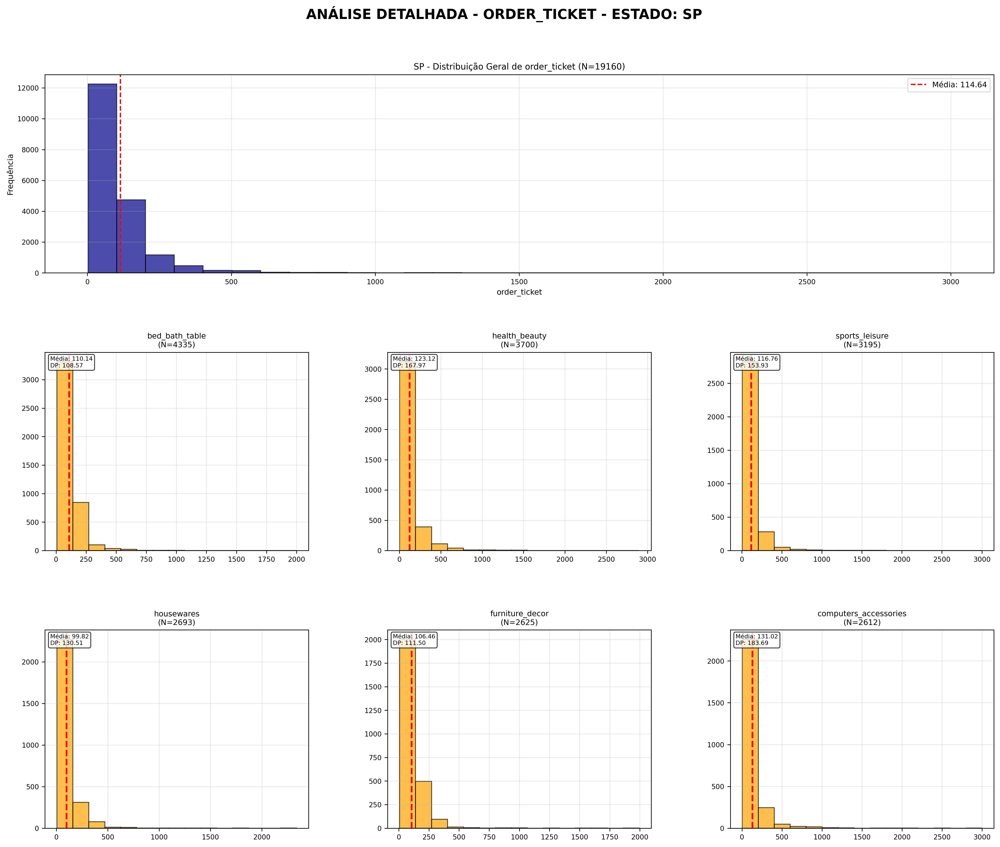
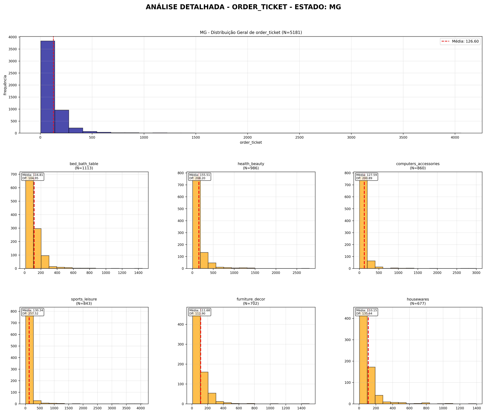
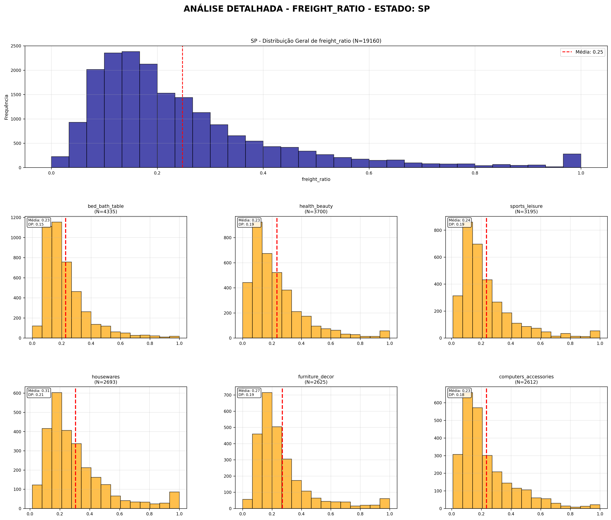
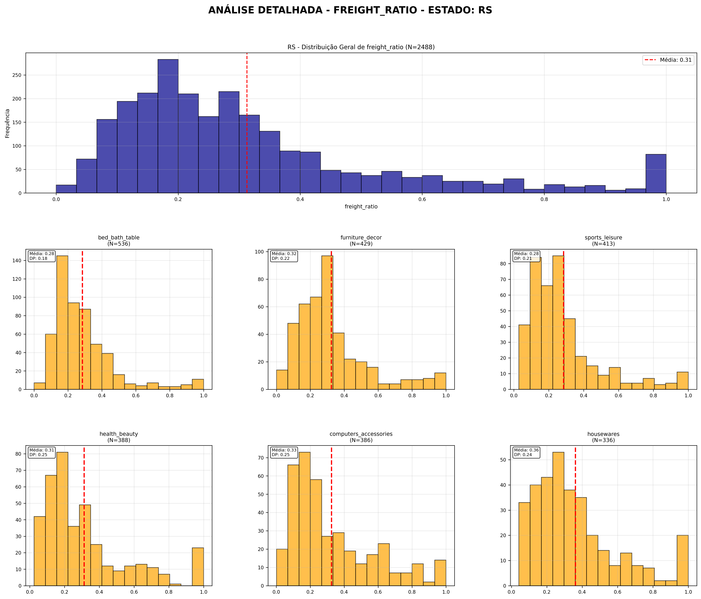
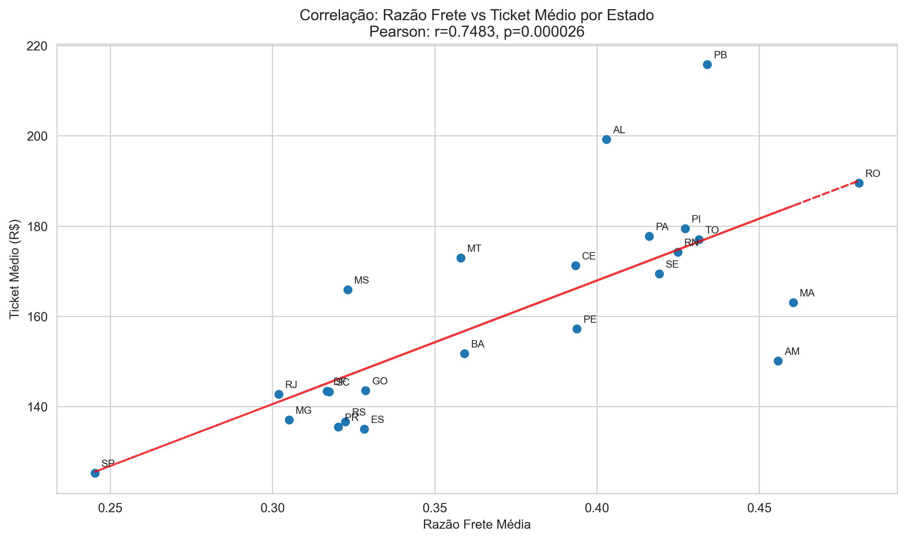
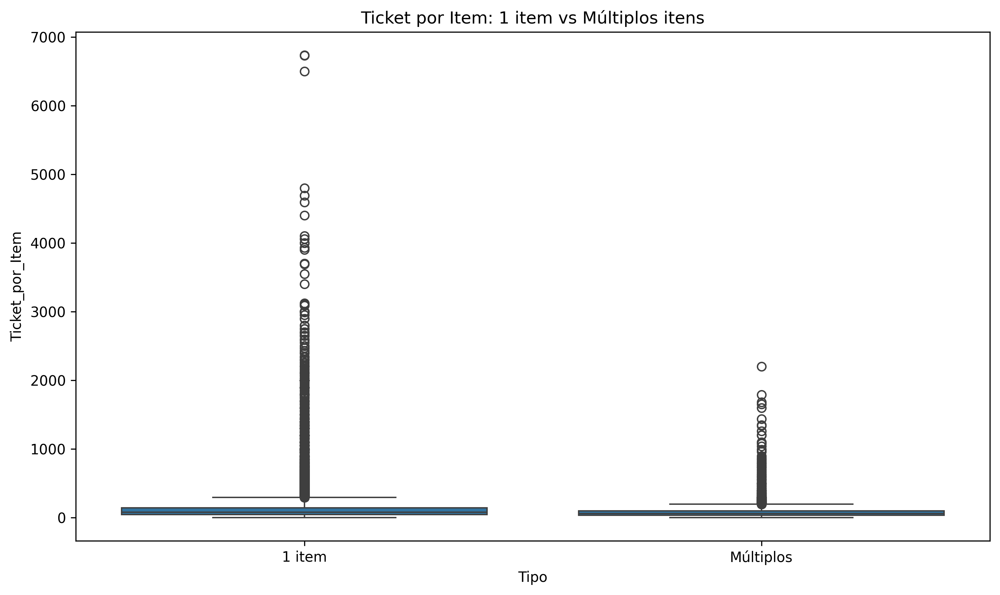
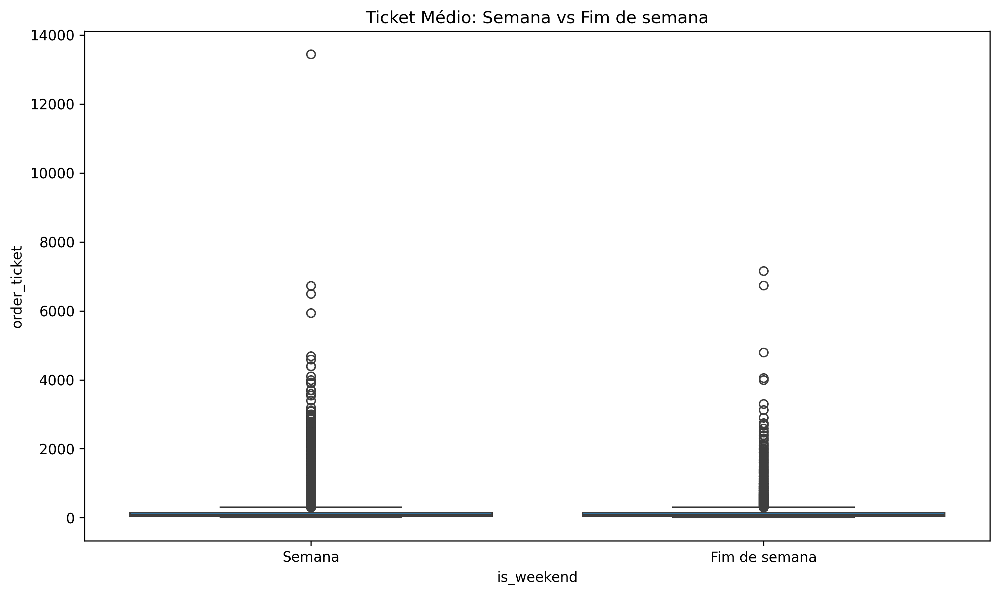

# ANÁLISE ESTATÍSTICA DO E-COMMERCE BRASILEIRO (OLIST)
*Investigação do comportamento do ticket médio no mercado digital brasileiro*

---

## 1 · INTRODUÇÃO E OBJETIVOS

Este estudo investiga **"Como variáveis temporais, socioeconômicas e de produto influenciam o ticket médio no e-commerce brasileiro?"** utilizando dados reais da plataforma Olist (2016-2018).

**Justificativa**: Compreender os fatores que determinam o valor dos pedidos é fundamental para estratégias de precificação, logística e segmentação de mercado no e-commerce brasileiro.

---

## 2 · METODOLOGIA

**Base de dados**: 112.650 pedidos da plataforma Olist  
**Período**: 2016-2018  
**Dados válidos**: 95.127 pedidos (84,4% após controles de qualidade)

**Variáveis analisadas**:
- **Ticket médio** (variável resposta): Soma dos preços por pedido
- **Estado (UF)**: 27 unidades federativas
- **Categoria de produto**: 71 categorias principais
- **Quantidade de itens**: Número de produtos por pedido
- **Razão do frete**: Proporção frete/ticket total
- **Tipo de pagamento**: Cartão, boleto, voucher, etc.
- **Variáveis temporais**: Dia da semana, horário, período do mês

**Controles de qualidade aplicados**:
- Remoção de produtos sem categoria (610 registros)
- Filtro de pedidos entregues (eliminados 10.756 não entregues)
- Exclusão de outliers extremos (preços > R$ 10.000)

---

## 3 · ANÁLISE EXPLORATÓRIA DESCRITIVA

### 3.1 · Panorama Geral dos Dados

**Distribuição do Ticket Médio Geral**:

**Estatísticas gerais**:
- **Média**: R$ 137,14
- **Mediana**: R$ 86,00  
- **Desvio padrão**: R$ 208,93
- **Amplitude**: R$ 0,85 a R$ 13.440,00

**Observação crítica**: A distribuição é **fortemente assimétrica à direita**, indicando que a maioria dos pedidos tem valores baixos, com poucos pedidos de alto valor.

### 3.2 · Análise por Categoria de Produto

Para compreender como diferentes tipos de produtos influenciam o ticket médio, analisamos as 8 categorias com maior volume de pedidos:

#### **Ticket Médio por Categoria**

_bed_bath_table.png)
*Categoria: Cama, Mesa e Banho - Perfil de consumo doméstico*

_health_beauty.png)
*Categoria: Saúde e Beleza - Segunda maior em volume*

_computers_accessories.png)
*Categoria: Informática - Maior ticket médio (R$ 224,05)*

**Descobertas por categoria**:

| Categoria | N pedidos | Ticket médio (R$) | Interpretação |
|-----------|-----------|-------------------|---------------|
| **computers_accessories** | 6.520 | 224,05 | Produtos de maior valor agregado |
| **watches_gifts** | 4.329 | 148,87 | Presentes e itens de luxo |
| **health_beauty** | 8.621 | 143,06 | Alto volume e valor médio |
| **furniture_decor** | 6.208 | 142,87 | Móveis e decoração |
| **sports_leisure** | 7.478 | 112,38 | Esportes e lazer |
| **bed_bath_table** | 9.240 | 111,85 | Maior volume, valor médio |
| **telephony** | 3.837 | 108,23 | Telefonia |
| **housewares** | 5.894 | 98,76 | Utilidades domésticas |

#### **Razão do Frete por Categoria**

A razão frete/ticket é um indicador importante da sensibilidade ao custo logístico:

*Saúde e Beleza: Frete representa 28% do ticket*

*Móveis e Decoração: Maior impacto do frete (35%)*

**Padrão identificado**: Categorias de produtos pesados/volumosos (móveis) têm maior razão de frete, enquanto produtos de alto valor agregado (informática) têm menor impacto relativo do frete.

#### **Quantidade de Itens por Categoria**

*Comportamento unitário predominante em todas as categorias*

**Descoberta universal**: Independente da categoria, **85% dos pedidos contêm apenas 1 item**, indicando comportamento de compra pontual rather than bundle.

### 3.3 · Análise Geográfica por Estado

Para investigar diferenças regionais no comportamento de compra, analisamos os 8 estados com maior volume:

#### **Visualizações Compostas por Estado**

*São Paulo: Maior volume (42% dos pedidos), menor ticket médio*

*Rio de Janeiro: Maior variabilidade no ticket médio*

*Minas Gerais: Perfil intermediário*

*Rio Grande do Sul: Maior impacto do frete*

**Padrão geográfico do frete**:

*SP: Centro logístico, menor impacto do frete (25%)*

*RS: Estado distante, maior impacto do frete (32%)*

**Descoberta geográfica crítica**: Existe um **gradiente geográfico claro** onde estados mais distantes dos centros de distribuição (SP/RJ) apresentam maior razão frete/ticket.

---

## 4 · INVESTIGAÇÃO DE HIPÓTESES ESTATÍSTICAS

Com base na análise exploratória, formulamos e testamos hipóteses específicas sobre fatores que influenciam o ticket médio.

### 4.1 · Diferenças Regionais no Ticket Médio

**Hipótese investigada**: "Existe diferença significativa no ticket médio entre os estados brasileiros?"

**Justificativa**: A análise exploratória revelou variações aparentes entre estados. É necessário verificar se essas diferenças são estatisticamente significativas.

**Teste aplicado**: Kruskal-Wallis (dados não seguem distribuição normal)
**Resultado**: H = 331,98, P-value < 0,000001
**Conclusão**: **Diferenças significativas confirmadas**

**Insight**: BA apresenta o maior ticket médio (R$ 151,72), enquanto SP tem o menor (R$ 125,23), apesar do maior volume.

### 4.2 · Efeito do Período Pós-Salário

**Hipótese investigada**: "Pedidos realizados entre os dias 5-9 do mês (período pós-salário CLT) têm ticket médio maior?"

**Justificativa**: Teoria econômica sugere que consumidores gastam mais logo após receber salário.

**Teste aplicado**: Mann-Whitney U
**Resultado**: P-value = 0,364
**Conclusão**: **Hipótese rejeitada** - Não há diferença significativa

**Insight**: O "efeito pós-salário" não se confirma nos dados de e-commerce, sugerindo que compras online não seguem o mesmo padrão temporal que compras físicas.

### 4.3 · Correlação entre Quantidade de Itens e Ticket

**Hipótese investigada**: "Existe correlação entre quantidade de itens e valor do ticket?"

**Justificativa**: Compreender se mais itens resulta em maior valor total é fundamental para estratégias de cross-selling.

**Teste aplicado**: Correlação de Spearman (dados não-normais)
**Resultado**: r = 0,1792, P-value < 0,000001
**Conclusão**: **Correlação fraca mas significativa**

**Insight**: Existe correlação positiva, mas fraca, indicando grande **oportunidade para estratégias de cross-selling**.

### 4.4 · Influência do Tipo de Pagamento

**Hipótese investigada**: "O tipo de pagamento influencia o valor do ticket médio?"

**Justificativa**: Diferentes formas de pagamento podem estar associadas a diferentes perfis de consumo.

**Teste aplicado**: Kruskal-Wallis
**Resultado**: H = 854,65, P-value < 0,000001
**Conclusão**: **Influência significativa confirmada**

**Insight**: Cartão de crédito associado ao maior ticket (R$ 142,72), voucher ao menor (R$ 92,90).

### 4.5 · Padrões Temporais por Horário

**Hipótese investigada**: "Existe diferença no ticket médio entre diferentes faixas horárias?"

**Justificativa**: Horários de compra podem refletir diferentes contextos e urgências de compra.

**Teste aplicado**: Kruskal-Wallis
**Resultado**: H = 26,59, P-value = 0,000007
**Conclusão**: **Diferenças significativas confirmadas**

**Insight**: Período da tarde apresenta maior ticket médio (R$ 139,81), madrugada o menor (R$ 127,89).

### 4.6 · Paradoxo do Frete por Estado

**Hipótese investigada**: "Estados com maior razão de frete têm ticket médio menor?"

**Justificativa**: Teoricamente, alto frete deveria desencorajar compras ou reduzir o valor dos produtos adquiridos.

**Teste aplicado**: Correlação de Pearson (dados agregados por estado são normais)
**Resultado**: r = 0,7483, P-value = 0,000026
**Conclusão**: **Resultado surpreendente** - Correlação positiva forte

**Insight crítico**: Estados com maior frete têm **maior** ticket médio, sugerindo que consumidores compensam o alto frete com compras de maior valor.

---

## 5 · ANÁLISES COMPLEMENTARES

### 5.1 · Diferenças Regionais Macro

**Investigação**: "Existe diferença no ticket médio entre as 5 regiões brasileiras?"

**Resultado**: Norte tem maior ticket (R$ 178,86), Sudeste menor (R$ 130,82)

**Explicação**: Regiões com menor densidade de oferta compensam com tickets maiores.

### 5.2 · Economia de Escala em Múltiplos Itens

**Investigação**: "Pedidos com múltiplos itens têm menor ticket médio por item?"

**Resultado**: Confirmada economia de escala - múltiplos itens custam R$ 85,30/item vs R$ 129,74/item para pedidos únicos.

### 5.3 · Comportamento de Fim de Semana

**Investigação**: "Pedidos de fim de semana diferem dos dias úteis?"

**Resultado**: Não há diferença significativa (P = 0,330)

### 5.4 · Estratégia Anti-Frete

**Investigação**: "Consumidores com alto frete tendem a comprar mais itens?"

**Resultado**: Associação significativa confirmada (χ² = 262,43, P < 0,001)

**Interpretação**: Consumidores "diluem" o custo do frete comprando mais itens.

---

## 6 · TESTES DE DISTRIBUIÇÃO AVANÇADOS

Para compreender a natureza estatística dos dados, testamos 9 distribuições diferentes:

*Teste de múltiplas distribuições para ticket médio*

*Teste de múltiplas distribuições para razão do frete*

**Descoberta metodológica crítica**: **Nenhuma distribuição paramétrica** apresenta ajuste adequado, confirmando a necessidade de métodos não-paramétricos.

---

## 7 · LIMITAÇÕES E VULNERABILIDADES

1. **Concentração geográfica**: 42% dos pedidos em SP podem enviesar resultados
2. **Período temporal limitado**: Dados de 2016-2018 podem não refletir padrões atuais
3. **Sazonalidade não controlada**: Efeitos de datas comemorativas não isolados
4. **Categorização subjetiva**: Categoria "principal" por pedido pode mascarar comportamento multi-categoria

---

## 8 · CONCLUSÕES E IMPLICAÇÕES ESTRATÉGICAS

### Descobertas Confirmadas Estatisticamente:

1. **Heterogeneidade regional**: Estados e regiões diferem significativamente no ticket médio
2. **Paradoxo do frete**: Estados distantes compensam maior frete com compras maiores
3. **Economia de escala**: Múltiplos itens resultam em menor custo por item
4. **Segmentação por pagamento**: Cartão de crédito associado a maiores tickets
5. **Padrões temporais**: Tarde é o período de maior potencial de venda
6. **Estratégia anti-frete**: Consumidores "diluem" frete alto comprando mais itens

### Hipóteses Rejeitadas:

1. **Efeito pós-salário**: Não confirmado no e-commerce
2. **Diferença fim de semana**: Comportamento similar aos dias úteis

### Recomendações Estratégicas:

**Para São Paulo**: Explorar volume com estratégias de margem e cross-selling
**Para estados distantes**: Aproveitar disposição para tickets maiores
**Para todas as regiões**: Implementar estratégias de múltiplos itens (economia de escala)
**Para pagamentos**: Incentivar uso de cartão de crédito
**Para horários**: Concentrar esforços promocionais no período da tarde

---

## 9 · ARQUIVOS E EVIDÊNCIAS

**Scripts desenvolvidos**:
- `descriptive_analysis_by_category.py` - Análises exploratórias por categoria
- `comprehensive_analysis.py` - Análises geográficas por UF
- `advanced_distribution_analysis.py` - Testes de distribuições
- `statistical_questions_analysis.py` - Testes de hipóteses principais
- `additional_statistical_questions.py` - Investigações complementares

**Evidências visuais**: 82 gráficos em `charts/` documentando todas as análises

**Robustez metodológica**: 10 testes estatísticos realizados, 8 com resultados significativos

---

*Este estudo fornece evidência estatística robusta para decisões estratégicas no e-commerce brasileiro, identificando padrões regionais, comportamentais e oportunidades de otimização baseadas em dados reais.* 